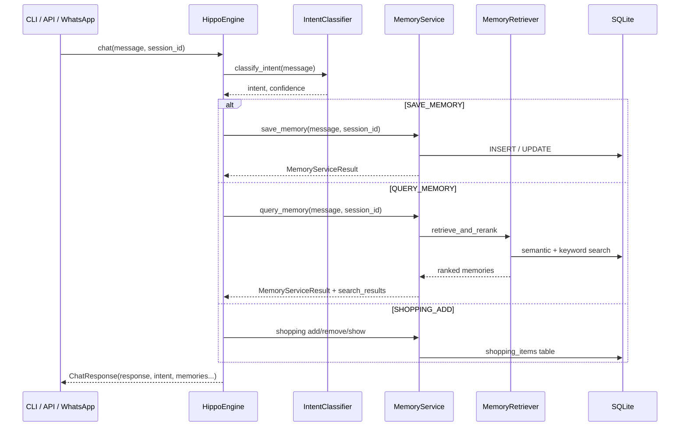

# Hippo Terminal — Architecture

## Overview

Hippo is a **memory engine** with thin interface adapters. All intelligence lives in `HippoEngine`. The CLI, future FastAPI server, and WhatsApp webhook are clients that call the same API.

```
┌─────────────┐   ┌─────────────┐   ┌─────────────┐
│  CLI Client │   │  FastAPI    │   │  WhatsApp   │
│  terminal   │   │  /chat      │   │  webhook    │
└──────┬──────┘   └──────┬──────┘   └──────┬──────┘
       │                 │                  │
       └─────────────────┼──────────────────┘
                         ▼
                 ┌───────────────┐
                 │  HippoEngine  │  ← single entry point
                 └───────┬───────┘
                         │
       ┌─────────────────┼─────────────────┐
       ▼                 ▼                 ▼
 IntentClassifier   MemoryService    ShoppingService
       │                 │                 │
       ▼                 ▼                 ▼
   LLM Client      MemoryRepository  ShoppingRepository
                         │
                         ▼
                    SQLite (hippo.db)
```

## Folder structure

```
app/
├── engine/                 # Orchestration — the product core
│   ├── hippo_engine.py     # HippoEngine public API
│   └── session.py          # Per-session dependency wiring
│
├── models/                 # Public & internal data models
│   ├── responses.py        # ChatResponse, MemorySnapshot, SessionStats
│   └── operations.py       # MemoryServiceResult, ShoppingServiceResult
│
├── services/               # Business logic (unchanged behaviour)
│   ├── memory_service.py   # Save, query, update, delete
│   ├── shopping_service.py # Shopping list operations
│   └── hippo_service.py    # General chat
│
├── database/               # Persistence layer (shims + repositories)
│   ├── memory_store.py     # → memory.py
│   ├── shopping_store.py   # → shopping.py
│   └── repositories/       # via repositories/ package
│
├── llm/                    # Language model layer
│   └── client.py           # → llm_client.py, classifier, embeddings
│
├── search/                 # Retrieval layer
│   └── retriever.py        # → retriever.py (semantic + rerank)
│
├── cli/                    # Terminal interface (display only)
│   └── terminal.py
│
├── api/                    # HTTP interface scaffold
│   └── server.py           # FastAPI — calls HippoEngine
│
├── prompts/                # LLM prompt templates
├── tests/                  # Pytest suite
├── main.py                 # CLI entry point
├── memory.py               # SQLite memory store (implementation)
├── shopping.py             # Shopping store (implementation)
├── retriever.py            # Two-stage retrieval (implementation)
└── hippo.py                # Legacy facade → HippoEngine
```

## Module descriptions

| Module | Responsibility |
|--------|----------------|
| **HippoEngine** | Classifies intent, routes to services, returns `ChatResponse`. Scopes all data to `session_id`. |
| **SessionServices** | Builds per-session repositories and services (session = user_id in SQLite). |
| **MemoryService** | Extracts and persists memories; returns structured `MemoryServiceResult`. |
| **ShoppingService** | Manages shopping list via natural language. |
| **IntentClassifier** | Maps user text → one of 9 intents via LLM. |
| **MemoryRetriever** | Semantic search + LLM re-ranking for recall. |
| **MemoryRepository** | CRUD wrapper over `MemoryStore`. |
| **CLI (`terminal.py`)** | Reads input, calls `engine.chat()`, prints `response.response`. |
| **API (`server.py`)** | FastAPI routes that delegate to `HippoEngine` — no duplicate logic. |

## Chat request flow



## Public API

```python
engine = HippoEngine()
await engine.initialize()

# Primary interface — used by CLI, API, WhatsApp
result = await engine.chat("where is my passport?", session_id="user-123")
print(result.response)       # "Found it. Passport is in the locker."
print(result.intent)         # "recall"
print(result.search_results) # [MemorySnapshot(...)]

# Direct access
memories = await engine.get_memories(session_id="user-123")
stats = await engine.get_stats(session_id="user-123")
await engine.delete_memory(memory_id="...", session_id="user-123")
await engine.clear_session(session_id="user-123")

# Sync wrapper for scripts
result = engine.chat_sync("buy milk", session_id="user-123")
```

## Session model

- **`session_id`** maps to `user_id` in SQLite — one row namespace per session.
- Multiple concurrent users: each gets a unique `session_id` (phone number, auth token, CLI uuid).
- `HippoEngine` caches `SessionServices` per session for efficiency.

## Future interfaces

### Web Terminal (Next.js)
```
Browser → FastAPI POST /chat { message, session_id } → HippoEngine → JSON ChatResponse
```
Session from JWT or anonymous browser id. Same engine, no backend duplication.

### WhatsApp
```python
@app.post("/webhook")
async def webhook(payload: WhatsAppMessage):
    response = await engine.chat(payload.text, session_id=payload.phone_number)
    await send_whatsapp(payload.phone_number, response.response)
```
Phone number = `session_id`. Engine unchanged.

### Desktop app
Local `HippoEngine` instance with a native UI calling `engine.chat()` — identical to CLI but with rich rendering of `ChatResponse.search_results`.

## Running

```bash
# CLI
python3 app/main.py

# API (requires: pip install fastapi uvicorn)
uvicorn api.server:create_app --factory --app-dir app
```

## Design principles

1. **One brain** — `HippoEngine` owns all orchestration.
2. **Structured responses** — `ChatResponse`, never raw strings at the boundary.
3. **Dependency injection** — LLM, embeddings, classifier injectable for tests.
4. **Session isolation** — no global user state.
5. **Preserve behaviour** — existing logic moved, not rewritten.
